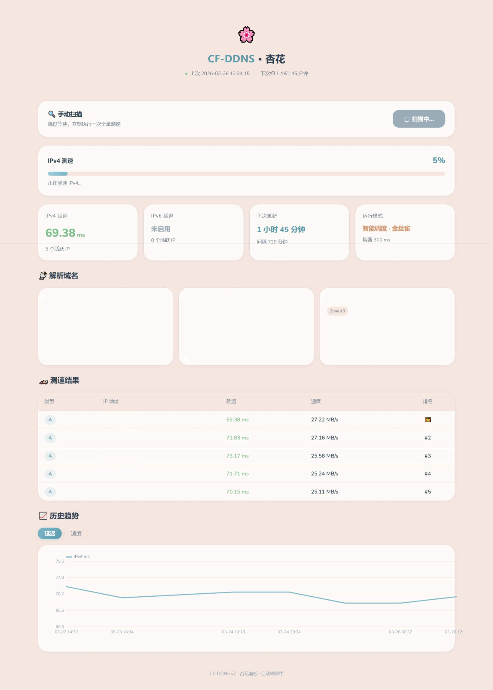

# ⚡ CF-DDNS

**你的 Cloudflare 节点，从此自己挑。**

一个运行在 Docker 上的全自动 Cloudflare 优选 IP 工具。它测速，它筛选，它更新 DNS——然后安静地等待下一轮。

---

## 它做了什么

CF-DDNS 每隔一段时间对 Cloudflare CDN 节点进行延迟和速度测试，自动把最快的 IP 更新到你的 DNS 解析记录上。

不多不少，就这一件事。做到极致。

---

## 为什么用它

**多域名，各自独立。** 三个域名、三个 Zone、三套 Token。测速只跑一次，结果分发给所有域名。加域名只需要在配置文件里多写三行。

**一键手动触发。** 不想等？面板上点一下，立刻开始全量扫描，进度条实时跟踪。

**渐进式更新。** 金丝雀模式下，每轮只替换一个 IP。出了问题，下一轮自动回滚。你的服务始终在线。

**智能调度。** 连续几轮 IP 没变化？休眠间隔自动翻倍。检测到变更？立刻回到高频模式。该快的时候快，该省的时候省。

**熔断保护。** 当网络剧烈波动时，最快的 IP 延迟都超标，系统拒绝更新，保留原有记录。宁可不动，不可乱动。

**失败重试。** 每次 API 调用自带指数退避重试。偶发的网络抖动不会影响你的 DNS。

**状态面板。** 浏览器打开就能看。当前 IP、延迟排名、历史趋势，一目了然。

---

## 快速开始

### 1. 克隆

```bash
git clone https://github.com/VonPeii/cf-ddns.git
cd cf-ddns
```

### 2. 下载测速工具

从 [XIU2/CloudflareSpeedTest](https://github.com/XIU2/CloudflareSpeedTest/releases) 下载对应架构的版本，放到项目根目录。

```bash
# 示例：ARM64 架构（软路由常用）
wget -O cfst_linux_arm64.tar.gz https://github.com/XIU2/CloudflareSpeedTest/releases/download/v2.2.5/CloudflareST_linux_arm64.tar.gz
```

### 3. 配置

复制示例配置，填入你的凭据：

```bash
cp .env.example .env
nano .env
```

```env
DOMAIN_1_NAME=blog.example.com
DOMAIN_1_ZONE_ID=你的Zone_ID
DOMAIN_1_TOKEN=你的API_Token

DOMAIN_2_NAME=cdn.example.net
DOMAIN_2_ZONE_ID=你的Zone_ID
DOMAIN_2_TOKEN=你的API_Token

DOMAIN_3_NAME=img.example.org
DOMAIN_3_ZONE_ID=你的Zone_ID
DOMAIN_3_TOKEN=你的API_Token
```

加更多域名？继续往下写 `DOMAIN_4_*`、`DOMAIN_5_*`……不用改任何代码。

### 4. 启动

```bash
docker compose up -d --build
```

完事了。

---

## 状态面板

启动后访问 `http://你的IP:8088`

<p align="center">
  
</p>

面板展示：当前生效 IP · 延迟与速度排名 · 历史趋势图 · 运行模式 · 倒计时
每 60 秒自动刷新。

---

## 配置参考

### docker-compose.yml 中的环境变量

| 变量 | 默认值 | 说明 |
|------|--------|------|
| `INTERVAL` | `86400` | 基础测速间隔（秒） |
| `CFST_TL` | `250` | 延迟上限（ms） |
| `CFST_SL` | `5` | 速度下限（MB/s） |
| `IP_COUNT` | `5` | 保留最优 IP 数量 |
| `ENABLE_IPV4` | `true` | 启用 IPv4 测速 |
| `ENABLE_IPV6` | `true` | 启用 IPv6 测速 |
| `ABORT_LATENCY` | `300` | 熔断阈值（ms） |
| `CANARY_MODE` | `false` | 金丝雀渐进更新 |
| `CANARY_MAX_CHANGES` | `1` | 每轮最大变更数 |
| `API_MAX_RETRIES` | `3` | API 失败重试次数 |
| `API_BASE_DELAY` | `5` | 重试基础等待（秒） |
| `SMART_INTERVAL` | `true` | 智能调度间隔 |
| `SMART_STABLE_THRESHOLD` | `3` | 稳定几轮后翻倍 |
| `MAX_INTERVAL` | `172800` | 最大休眠间隔（秒） |
| `WEB_PORT` | `8088` | 面板端口 |
| `HISTORY_MAX` | `200` | 历史记录保留条数 |

### .env 中的凭据

| 变量 | 说明 |
|------|------|
| `DOMAIN_N_NAME` | 第 N 个域名 |
| `DOMAIN_N_ZONE_ID` | 第 N 个域名的 Zone ID |
| `DOMAIN_N_TOKEN` | 第 N 个域名的 API Token |

---

## 日常操作

```bash
# 查看日志
docker compose logs -f

# 改了环境变量后生效
docker compose up -d

# 改了代码/Dockerfile 后重新构建
docker compose up -d --build

# 停止
docker compose down
```

---

## 项目结构

```
cf-ddns/
├── .env.example        # 凭据配置模板
├── .gitignore
├── LICENSE
├── README.md
├── Dockerfile
├── docker-compose.yml
├── update.sh           # 核心逻辑
├── healthcheck.sh      # 健康检查
└── web/
    └── index.html      # 状态面板
```

---

## 致谢

测速能力由 [XIU2/CloudflareSpeedTest](https://github.com/XIU2/CloudflareSpeedTest) 提供。

---

## License

[MIT](LICENSE)
